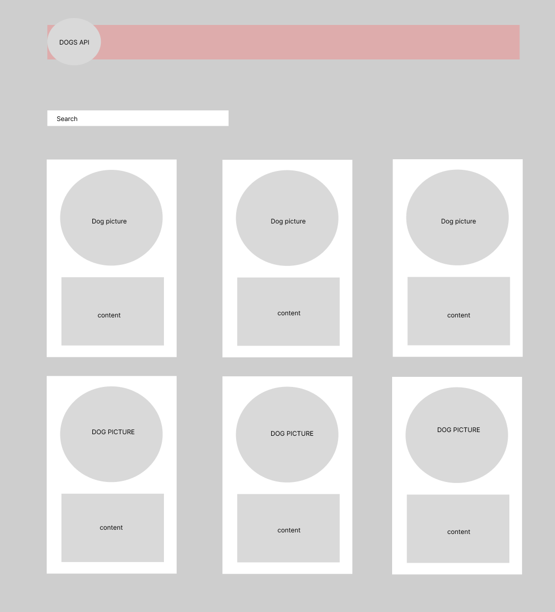

# dog-search-api

<figure>
    
</figure>

## PROJECT STEPS:
 
1. ### Set Up the Project

Create a new project directory.

Initialize a new GitHub project.

Set up the project structure with index.html, styles.css, and script.js.

2. ### Fetch Dog Data from an API 

https://dog.ceo/api/breeds/list/all

Fetch dog image endpoint API https://dog.ceo/dog-api/documentation/breed

Write a function to fetch dog images from the API.

3. ### Display Data on Cards

Create the basic HTML structure in index.html.

Style the cards with CSS in styles.css.

Write JavaScript to populate the gallery with fetched data in script.js.

Create the Filter functionality.

4. ### Add Images and Descriptions

Add descriptions to the dog cards.

Use static descriptions based on image URL or breed.

(Optionally, find another API for detailed descriptions.)

5. ### Test and Refine
Open index.html in a web browser to test the dog gallery.

Refine CSS for better styling.

Enhance JavaScript for better functionality, such as error handling and loading indicators.